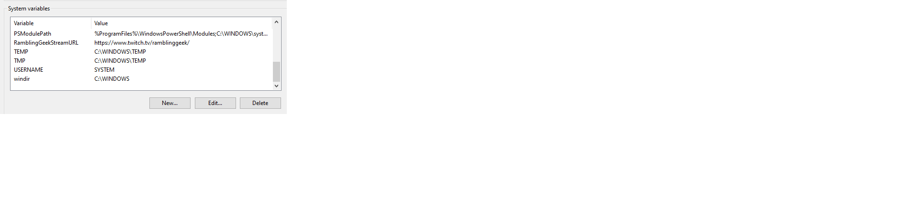
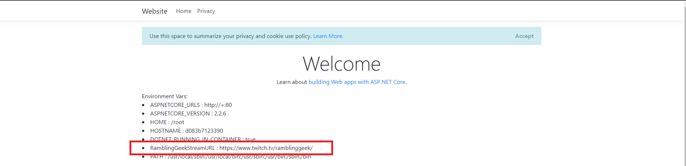

How to use

Set a windows environment variable

clone this repo

cd into the repo

run `docker-compose up`

go to `http:\\localhost:4004`

Environment variable has been mapped from the host during the docker-compose

